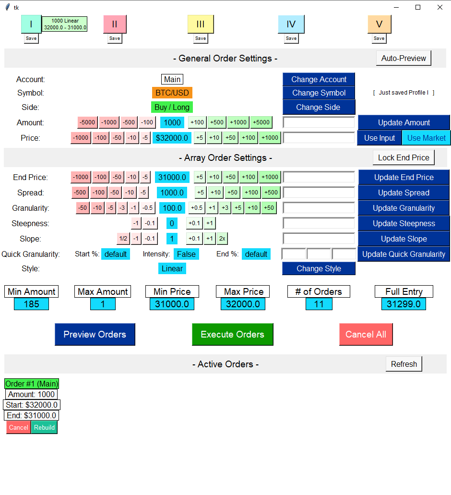

[![Contributors][contributors-shield]][contributors-url]
[![Forks][forks-shield]][forks-url]
[![Stargazers][stars-shield]][stars-url]
[![Issues][issues-shield]][issues-url]
[![MIT License][license-shield]][license-url]
[![LinkedIn][linkedin-shield]][linkedin-url]


<!-- PROJECT LOGO -->
<br />
<p align="center">
  <a href="https://github.com/EvanGottschalk/OperateExchangeGUI">
    
  </a>

  <h3 align="center">OperateExchangeGUI</h3>

  <p align="center">
    A GUI that allows the user to easily create, modify, and cancel array orders on cryptocurrency exchanges
    <br />
    <a href="https://github.com/EvanGottschalk/OperateExchangeGUI"><strong>Explore the docs »</strong></a>
    <br />
    <br />
    <a href="https://github.com/EvanGottschalk/OperateExchangeGUI">View Demo</a>
    ·
    <a href="https://github.com/EvanGottschalk/OperateExchangeGUI/issues">Report Bug</a>
    ·
    <a href="https://github.com/EvanGottschalk/OperateExchangeGUI/issues">Request Feature</a>
  </p>
</p>


<!-- TABLE OF CONTENTS -->
<details open="open">
  <summary><h2 style="display: inline-block">Table of Contents</h2></summary>
  <ol>
    <li>
      <a href="#about-the-project">About The Project</a>
      <ul>
        <li><a href="#built-with">Built With</a></li>
      </ul>
    </li>
    <li>
      <a href="#getting-started">Getting Started</a>
      <ul>
        <li><a href="#prerequisites">Prerequisites</a></li>
        <li><a href="#installation">Installation</a></li>
      </ul>
    </li>
    <li><a href="#usage">Usage</a></li>
    <li><a href="#roadmap">Roadmap</a></li>
    <li><a href="#contributing">Contributing</a></li>
    <li><a href="#license">License</a></li>
    <li><a href="#contact">Contact</a></li>
    <li><a href="#acknowledgements">Acknowledgements</a></li>
  </ol>
</details>


<!-- ABOUT THE PROJECT -->
## About The Project

`OperateExchangeGUI` displays an intricate, customizable interface for trading cryptocurrencies. Through the help of its partner program `OperateExchange`, users can create or cancel multiple orders with customizable parameters. This saves users the trouble of calculating price and volume related ratios, and then can execute their ideal array of orders with only a few clicks.**

** *Some exchanges have an API rate limit, which means you can only put in so many orders per time. Read the API limit rules for the particular exchange if you want to use `OperateExchangeGUI` or `OperateExchange` to create multiple orders on it.*

### Built With

`Python`

[`CCXT`](https://github.com/ccxt/ccxt) - The fantastic `CCXT` library is critical to this program. Huge thanks to [@kroitor](https://github.com/kroitor) and the many other `CCXT` contributors that made this program possible.

[`OperateExchange`](https://github.com/EvanGottschalk/OperateExchange) - This program is the brains behind `OperateExchangeGUI`. The buttons in the GUI all send commands to `OperateExchange`, which then interprets them, checks them, and finally executes them via `ConnectToExchange`. You can read more about it here: [https://github.com/EvanGottschalk/OperateExchange](https://github.com/EvanGottschalk/OperateExchange)

[`ConnectToExchange`](https://github.com/EvanGottschalk/connecttoexchange) - This program creates the initial connection to a cryptocurrency exchange. You can read more about it here: [github.com/EvanGottschalk/ConnectToExchange](https://github.com/EvanGottschalk/connecttoexchange)

[`GetCurrentTime`](https://github.com/EvanGottschalk/GetCurrentTime) - This program is imported to help collect time data in a legible fashion. It also allows for the translation of time stamps. You can read more about it here: [github.com/EvanGottschalk/GetCurrentTime](https://github.com/EvanGottschalk/GetCurrentTime)

[`AudioPlayer`](https://github.com/EvanGottschalk/AudioPlayer) - This is a simple program for playing custom audio alerts. It can be used with `ConnectToExchange` to warn you if an error occurs. You can read more about it here: [github.com/EvanGottschalk/AudioPlayer](https://github.com/EvanGottschalk/AudioPlayer)

`QuadraticFormula` - This is a simple program for calculating the solutions to a quadratic equation using the quadratic formula.

<!-- GETTING STARTED -->
## Getting Started

### Prerequisites

Before using `OperateExchangeGUI`, you must first obtain an API key and secret from the cryptocurrency exchange of their choosing. You also need to install the [`CCXT`](https://github.com/ccxt/ccxt) library. If your API key is `view-only`, you can still use `OperateExchangeGUI` to calculate & graph groups of orders with custom ratios. If it has `trade` priveleges, then those orders can be executed and canceled as well.

### Installation

1. Install [`CCXT`](https://github.com/ccxt/ccxt). This can be done in a number of ways. I used `pip`.
   ```sh
   pip install ccxt
   ```
2. Download the `.py` files from this repository (`OperateExchangeGUI.py`,`OperateExchange.py`, `ConnectToExchange.py`, `GetCurrentTime.py`, `QuadraticFormula.py`, and optionally `AudioPlayer.py`)

3. In the same folder as `ConnectToExchange.py`, create a `.txt` file to store your API information. Its name should start with the exchange you are using, followed by an underscore, followed by the name of the account you're using, and ending with `_API.txt`.

  For example, if you are using your **Main** account on **Coinbase**, you would name the `.txt` file **`Coinbase_Main_API.txt`**

  If your API key is `view-only`, you can save your cryptocurrency exchange API key on the 1st line, and your API secret on the 2nd. However, **if your API key has `trade` priveleges, you should save an encrypted version of both your key and secret on those lines instead.**

  To encrypt your API information, I recommend using `CustomEncryptor.py`, which can be downloaded here: [github.com/EvanGottschalk/CustomEncryptor](https://github.com/EvanGottschalk/CustomEncryptor)

4. Run `OperateExchangeGUI.py`

5. Congratulations! You can now use `OperateExchangeGUI` to calculate, graph, create and cancel orders on your chosen cryptocurrency exchange!


<!-- USAGE EXAMPLES -->
## Usage

Users can customize, create & execute orders using the GUI. Here's what it looks like:

<br />
<p align="center">
  <a href="https://github.com/EvanGottschalk/OperateExchangeGUI">
    
  </a>
</p>

The main function of the GUI is to customize and create "Array Orders". An Array Order is an array of orders - a group of orders whose relative values are chosen with the goal of achieving optimal average buy prices or sell prices.

## Buttons

### Profile Buttons

`Profile Buttons` - These are the buttons labeled `I` through `V` along the top of the GUI. Clicking `Save` underneath one of these labeled buttons stores the current order settings to that button. One can then click on that button in the future to load the settings associated to that Roman numeral. A brief description of those order settings are displayed next to the corresponding labeled button after settings have been saved or loaded. The current order settings have been saved to the `I` profile in the screenshot above.

### General Order Settings

`Auto-Preview` - This button toggles the `auto_preview` setting, which controls how the GUI will respond when a user changes order settings. If the `Auto-Preview` button is up, then `auto_preview` is set to `False`, and the current order settings won't be previewed until the `Preview Orders` button or the `Execute Orders` button has been clicked. This means that, when order settings are changed, the order parameters further down the screen (e.g. `Min Amount` and `# of Orders`) will not be updated, but grayed out instead. The order parameters like `# of Orders` won't be updated until the `Preview Orders` or `Execute Orders` buttons are pressed. Keeping `Auto-Preview` off can be helpful because it significantly eliminates lag in the GUI, particularly with more complex orders. If the `Auto-Preview` button is down, then the order parameters like `# of Orders` will update every time settings are changed, and a new graph will be rendered every time as well.

`Change Account` - Clicking this displays a list of accounts the user has chosen to be available. The user can then click the name of an account to switch the current API connection and use that account's API information to connect to the exchange. The current `account` is displayed to the left of the button.

`Change Symbol` - Clicking this displays a list of cryptocurrency abbreviations that are available to be traded (e.g. `BTC/USD`, `ETH/USDT`). The user can then click on the abbreviation of their choice to trade that currency. The current cryptocurrency `symbol` to be traded is dislpayed to the left of the button.

`Change Side` - Clicking this toggles the `side` of the order between `buy` and `sell`. The current `side` is displayed to the left of the button.

`Update Amount` - Clicking this changes the current size of the array order to be the value input in the field to on its left. Users type in the total size of the Array Order in the field to the left of the `Update Amount` button. Users may also click the "nudge" buttons (e.g. `-5000`, `+100`) to change the size of the current Array Order by the corresponding value. The current total `amount` of value in the Array Order is displayed between the "nudge" buttons.

`Use Input` - Clicking this changes the starting `price` of the array order to be the value input in the field to on its left. This "starting" price is the highest price in a `buy` Array Order or the lowest price in a `sell` Array Order. The order with the lowest `amount` will always be at the input `price`. Users may also click the "nudge" buttons (e.g. `-1000`, `+100`) to change the starting price of the current Array Order by the corresponding value. The current `price` is displayed between the "nudge" buttons.

`Use Market` - This button is a handy alternative to the `Use Input` button for changing the starting `price`. Clicking this changes the starting `price` of the array order to be its current market price.

### Array Order Settings

`Update End Price` - Clicking this changes the ending `price` of the Array Order to be the value input in the field to on its left. This "ending" price is the lowest price in a `buy` Array Order or the highest price in a `sell` Array Order. The order with the highest `amount` will always be at the input value. Users may also click the "nudge" buttons (e.g. `-1000`, `+100`) to change the ending price of the current Array Order by the corresponding value. The current ending price is displayed between the "nudge" buttons.

`Update Spread` - Clicking this changes the `spread` of the Array Order to be the value input in the field to on its left. The `spread` determines the price gap between the initial starting `price` and the end price. For example, a buy Array Order with a `spread` of $100 will have its lowest-value order priced $100 higher than its highest-value order. Users may also click the "nudge" buttons (e.g. `-100`, `+10`) to change the `spread` of the current Array Order by the corresponding value. The current `spread` is displayed between the "nudge" buttons.

`Update Granularity` - Clicking this changes the `granularity` of the Array Order to be the value input in the field to on its left. The `granularity` determines the price gap between individual orders in the array order. For example, a buy Array Order with a `granularity` of $10, a starting `price` of $100, and an ending price of $80, will consist of 3 individual orders: the smallest at $100, a larger one at $90, and the largest at $80. Changing the `granularity` allows users to modify the number of orders and the size of the individual orders without changing the starting `price`, ending price, or the total `amount` of the Array Order. Users may also click the "nudge" buttons (e.g. `-10`, `+1`) to change the `granularity` of the current Array Order by the corresponding value. The current `granularity` is displayed between the "nudge" buttons.

`Update Steepness` - Clicking this changes the `steepness` of the Array Order to the the value input in the field on its left. The `steepness` is an optional parameter that, when left at `0`, has no effect on the Array Order. As the `steepness` is increased, the value of orders close to the starting `price` get reduced in value, and the orders closer to the ending price get increased in value. The inverse is true as `steepness` is reduced - however, a negative `steepness` is not recommended. A higher `steepness` is characteristic of a more conservative, well-planned Array Order, in that it relies less on placing orders at suboptimal prices and greater emphasis on executing orders at or near optimal prices. Users may also click the "nudge" buttons (e.g. `-1`, `+0.1`) to change the `steepness` of the current Array Order by the corresponding value. The current `steepness` is displayed between the "nudge" buttons.

`Update Slope` - Clicking this changes the `slope` of the Array Order to the the value input in the field on its left. The `slope` is an optional parameter that controls the slope of the line created by graphing the prices of the individual orders in the Array Order. When left at `1`, it will have no effect on the Array Order. Changing the `slope` will change the total `amount` of the order. A higher slope means the values of the individual orders in the Array Order will be larger and increase more rapidly between the starting `price` and the ending price. Likewise, a lower slope causes the size of orders to be lower, and increase more slowly from beginning to end. Modifying the slope is a great way to increase or decrease the overall value of an Array Order while maintaining the same ratios between individual orders. Users may also click the "nudge" buttons (e.g. `-1`, `+0.1`) to change the `slope` of the current Array Order by the corresponding value. The current `slope` is displayed between the "nudge" buttons.

`Update Max Amount` / `Update Min Order` / `Update QG Intensity` - This button is currently used for testing. There are 3 different features that I have tried including in this location, but none of them have proven to be particularly useful. The particular button that is visible in this location depends on what the `row_17_button` variable is assigned to.

1. `Maximum Amount` - This is a cap on the total amount of the array of orders. When it's active, more profitable individual orders are placed with higher priority than less profitable ones. Thus, using a `Maximum Amount` that's less than total `amount` allows users to execute only the most profitable portion of an Array Order.
2. `Minimum Order Size` - This is the smallest any individual order is permitted to be in the Array Order. 
3. `Quick Granularity Intensity` - When this value is greater than 0, the Array Order will group orders more closely together near the start of an Array Order, and group them more loosely near the end of an Array Order. The higher the intensity, the more closely earlier orders are grouped and the more spread out the other orders are. Using `Quick Granularity` increases the probability of closing more orders in a shorter period of time.

`Change Style` - Clicking this displays a dropdown list of possible Array Order styles. The user can then click on the style of their choice to use that style. An Array Order's "style" determines the shape formed by graphing the sizes against the prices of the orders in the array. The current `style` is dislpayed to the left of the button. There are 7 different styles:
1. `Uniform` - This distributes the input `amount` across all orders evenly, forming a flat line when graphed.
2. `Linear` - This distributes the input `amount` at a constantly increasing rate, starting with the smallest order at the staring `price` and the biggest order at the ending price. This forms a diagonal line when graphed.
3. `Circular` - This distributes the input `amount` using the equation to graph a circle. This forms the bottom-right quarter of a circle when graphed.
4. `Transposed Circular` - This is identical to a `Circular` Array Order, except the array starts with higher orders further into the circular shape, and skips the earliest and smallest orders. This forms a portion of the bottom-right quarter of a circle when graphed.
5. `Parabolic` - This distributes the input `amount` at an exponentially increasing rate, starting with the smallest order at the staring `price` and the biggest order at the ending price. This forms half of a parabola when graphed.
6. `Fibonacci` - This distributes the input `amount` at a cumulatively increasing rate using the formula for the Fibonacci sequence. This forms a steep half-parabola when graphed.
7. `Multiplicative` - This style is customizable. It distributes the input `amount` at an exponentially increasing rate using the user's input `multiplicative_factor`. The larger the input `multiplicative_factor`, the more rapidly the prices in the Array Order increase. A `multiplicative_factor` 1 or larger forms a steep half-parabola when graphed. Below 1, the prices will increase much more slowly, and eventually start to decrease if the `multiplicative_factor` is low enough.

### Array Order Execute & Cancel Buttons

`Preview Orders` - Clicking this allows the user to preview the features and appearance of a potential Array Order before executing the orders. Specifically, clicking this button will first use `OperateExchange` to calculate the distribution of amounts across the potential Array Order. Then, a graph of the orders in the Array Order will be displayed, and the the GUI interface will be updated with specific information about the potential Array Order, such as the prices of its largest and smallest orders.

`Execute Orders` - Clicking this executes all of the orders in the chosen Array Order. They are executed one-by-one, staring with the smallest order at the starting `price` and ending with the largest order. The difference between the starting `price` and the price of the last order is equal to the chosen `spread` value.

`Cancel All Orders` - Clicking this simultaneously cancels all of the orders the user has open on the account `OperateExchangeGUI` is currently connected to.

### "- Active Orders -"

`Refresh` - Clicking this will make space in the `"- Active Orders -"` section of the GUI by removing orders that have been canceled or fully closed.

After creating an Array Order, information about it will be displayed in the "Active Orders" section of the GUI. Additionally, the information about each Array Order will also have its own set of buttons, which do the following:

`Cancel` - Clicking this cancels the associated Array Order, one order at a time.

`Rebuild` - Clicking this executes any orders in the original Array Order that are no longer active, whether it's because they were closed, canceled, or because they failed to even be executed in the first place.

<!-- ROADMAP -->
## Roadmap

See the [open issues](https://github.com/EvanGottschalk/OperateExchangeGUI/issues) for a list of proposed features (and known issues).


<!-- CONTRIBUTING -->
## Contributing

Contributions are what make the open source community such an amazing place to be learn, inspire, and create. Any contributions you make are **greatly appreciated**.

1. Fork the Project
2. Create your Feature Branch (`git checkout -b feature/AmazingFeature`)
3. Commit your Changes (`git commit -m 'Add some AmazingFeature'`)
4. Push to the Branch (`git push origin feature/AmazingFeature`)
5. Open a Pull Request


<!-- LICENSE -->
## License

Distributed under the GNU GPL-3 License. See `LICENSE` for more information.


<!-- CONTACT -->
## Contact

Evan Gottschalk - [@Fort1Evan](https://twitter.com/Fort1Evan) - magnus5557@gmail.com

Project Link: [https://github.com/EvanGottschalk/OperateExchangeGUI](https://github.com/EvanGottschalk/OperateExchangeGUI)


<!-- ACKNOWLEDGEMENTS -->
## Acknowledgements

* Huge thanks to [@kroitor](https://github.com/kroitor) and the many other [CCXT](https://github.com/ccxt/ccxt) contributors that made this program possible.
* Thanks to [@bartmassi](https://github.com/bartmassi) for working with me to improve the program's security, and for answering numerous other questions, and also for always being a helpful, available, and informative teacher (and friend).

Thinking about contributing to this project? Please do! Your Github username will then appear here.


<!-- MARKDOWN LINKS & IMAGES -->
<!-- https://www.markdownguide.org/basic-syntax/#reference-style-links -->
[contributors-shield]: https://img.shields.io/github/contributors/EvanGottschalk/OperateExchangeGUI.svg?style=for-the-badge
[contributors-url]: https://github.com/EvanGottschalk/OperateExchangeGUI/graphs/contributors
[forks-shield]: https://img.shields.io/github/forks/EvanGottschalk/OperateExchangeGUI.svg?style=for-the-badge
[forks-url]: https://github.com/EvanGottschalk/OperateExchangeGUI/network/members
[stars-shield]: https://img.shields.io/github/stars/EvanGottschalk/OperateExchangeGUI.svg?style=for-the-badge
[stars-url]: https://github.com/EvanGottschalk/OperateExchangeGUI/stargazers
[issues-shield]: https://img.shields.io/github/issues/EvanGottschalk/OperateExchangeGUI.svg?style=for-the-badge
[issues-url]: https://github.com/EvanGottschalk/OperateExchangeGUI/issues
[license-shield]: https://img.shields.io/github/license/EvanGottschalk/OperateExchangeGUI.svg?style=for-the-badge
[license-url]: https://github.com/EvanGottschalk/OperateExchangeGUI/blob/master/LICENSE.txt
[linkedin-shield]: https://img.shields.io/badge/-LinkedIn-black.svg?style=for-the-badge&logo=linkedin&colorB=555
[linkedin-url]: https://linkedin.com/in/EvanGottschalk
